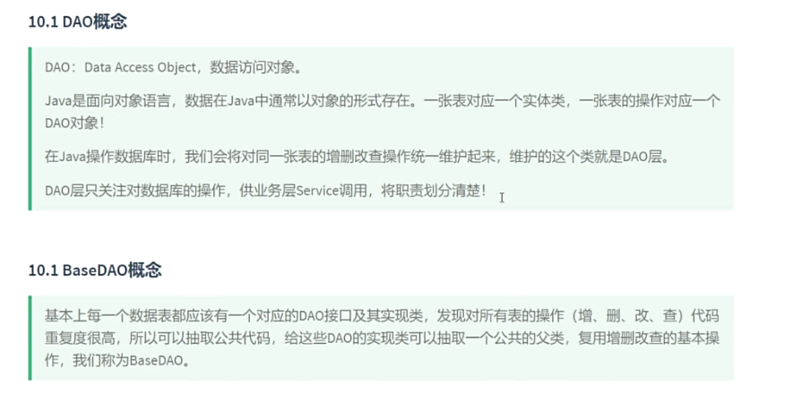

# 核心API

## 1.注册驱动

    Class.forName("com.mysql.cj.jdbc.Driver");

## 2. Connection 建立连接

    Connection connection = DriverManager.getConnection("jdbc:mysql://localhost:3306/atguigu", "root", "qwert123");

## 3. Statement 创建语句

1. 会产生SQL注入攻击问题
    ```java
    // 3. 获取执行SQL语句的对象
    Statement statement = connection.createStatement();
    // 4. 编写SQL语句
    String sql = "SELECT emp_id,emp_name,emp_salary,emp_age FROM t_emp";
    // 5. 执行
    ResultSet resultSet = statement.executeQuery(sql);
    ```

## 4. PreparedStatement 创建语句

1. 不会产生SQL注入攻击问题
2. 性能提升: 预编译SQL语句，统一SQL语句多次执行的情况下，可以复用
    ```java
    // 3. 获取执行SQL语句的对象
    PreparedStatement preparedStatement = connection.prepareStatement("SELECT emp_id,emp_name,emp_salary,emp_age FROM t_emp WHERE emp_name = ?");
    System.out.println(("请输入员工姓名："));
    Scanner scanner = new Scanner(System.in);
    String name = scanner.nextLine();
    // 4. 为？占位符赋值
    preparedStatement.setString(1,name);
    // 5. 执行
    ResultSet resultSet = preparedStatement.executeQuery();
    ```

## 5. ResultSet 获取结果集

1. 执行查询语句所返回的结果集
    ```java
     // 6. 处理结果
    while (resultSet.next()) {
        int empId = resultSet.getInt("emp_id");
        String empName = resultSet.getString("emp_name");
        double empSalary = resultSet.getDouble("emp_salary");
        int empAge = resultSet.getInt("emp_age");
        System.out.println(empId + " " + empName + " " + empSalary + " " + empAge);
    }
    // 7. 释放资源(先开后关原则)
    resultSet.close();
    statement.close();
    connection.close();
    ```
## 6、基于PreparedStatement实现CRUD
```java
package com.atguigu.base;

import org.junit.Test;

import java.sql.Connection;
import java.sql.DriverManager;
import java.sql.PreparedStatement;
import java.sql.ResultSet;

/**
 * @Author: Admin
 * @Create: 2024/6/13 - 上午9:32
 * @Version: v1.0
 * ClassName: JDBCOperation
 * Package: com.atguigu.base
 * Description: 描述
 */
public class JDBCOperation {
    @Test
    // 单行单列查询
    public void testQuerySingleRowAndColumn() throws Exception {
        // 1.注册驱动(可以省略)
        // 2.获取连接
        Connection connection = DriverManager.getConnection("jdbc:mysql://localhost:3306/atguigu", "root", "qwert123");
        // 3.预编译SQL语句得到PreparedStatement对象
        PreparedStatement preparedStatement = connection.prepareStatement("SELECT COUNT(*) as count FROM t_emp");
        // 4.执行SQL语句
        ResultSet resultSet = preparedStatement.executeQuery();
        // 5.处理结果
        while (resultSet.next()) {
            System.out.println(resultSet.getInt(1));
            System.out.println(resultSet.getInt("count"));
        }
        // 6.释放资源
        resultSet.close();
        preparedStatement.close();
        connection.close();
    }

    @Test
    // 单行多列查询
    public void testQuerySingleRow() throws Exception {
        // 1.注册驱动(可以省略)
        // 2.获取连接
        Connection connection = DriverManager.getConnection("jdbc:mysql://localhost:3306/atguigu", "root", "qwert123");
        // 3.预编译SQL语句得到PreparedStatement对象
        PreparedStatement preparedStatement = connection.prepareStatement("SELECT emp_id,emp_name,emp_salary,emp_age FROM t_emp WHERE emp_id = ?");
        // 4.为占位符赋值
        preparedStatement.setInt(1, 1);
        // 5.执行SQL语句
        ResultSet resultSet = preparedStatement.executeQuery();
        while (resultSet.next()) {
            System.out.println(resultSet.getInt("emp_id"));
            System.out.println(resultSet.getString("emp_name"));
            System.out.println(resultSet.getString("emp_salary"));
            System.out.println(resultSet.getString("emp_age"));
        }
        // 6.释放资源
        resultSet.close();
        preparedStatement.close();
        connection.close();
    }

    @Test
    // 多行多列查询
    public void testQueryMultiRow() throws Exception {
        // 1.注册驱动(可以省略)
        // 2.获取连接
        Connection connection = DriverManager.getConnection("jdbc:mysql://localhost:3306/atguigu", "root", "qwert123");
        // 3.预编译SQL语句得到PreparedStatement对象
        PreparedStatement preparedStatement = connection.prepareStatement("SELECT emp_id,emp_name,emp_salary,emp_age FROM t_emp WHERE emp_age > ?");
        // 4.为占位符赋值
        preparedStatement.setInt(1, 25);
        // 5.执行SQL语句
        ResultSet resultSet = preparedStatement.executeQuery();
        while (resultSet.next()) {
            int empId = resultSet.getInt("emp_id");
            String empName = resultSet.getString("emp_name");
            double empSalary = resultSet.getDouble("emp_salary");
            int empAge = resultSet.getInt("emp_age");
            System.out.println(empId + "\t" + empName + "\t" + empSalary + "\t" + empAge);
        }
        // 6.释放资源
        resultSet.close();
        preparedStatement.close();
        connection.close();
    }

    @Test
    // 新增
    public void testInsert() throws Exception {
        // 1.注册驱动(可以省略)
        // 2.获取连接
        Connection connection = DriverManager.getConnection("jdbc:mysql://localhost:3306/atguigu", "root", "qwert123");
        // 3.预编译SQL语句得到PreparedStatement对象
        PreparedStatement preparedStatement = connection.prepareStatement("INSERT INTO t_emp(emp_name,emp_salary,emp_age) VALUES (?,?,?)");
        // 4.为占位符赋值
        preparedStatement.setString(1, "张三");
        preparedStatement.setDouble(2, 5000);
        preparedStatement.setInt(3, 25);
        int count = preparedStatement.executeUpdate();
        System.out.println(count > 0 ? "成功" : "失败");
        // 释放资源
        preparedStatement.close();
        connection.close();

    }

    @Test
    // 修改
    public void testUpdate() throws Exception {
        // 1.注册驱动(可以省略)
        // 2.获取数据库连接
        Connection connection = DriverManager.getConnection("jdbc:mysql://localhost:3306/atguigu", "root", "qwert123");
        // 3.创建Statement对象
        PreparedStatement preparedStatement = connection.prepareStatement("update t_emp set emp_salary = ? where emp_id = ?");
        // 4.为占位符赋值，索引从1开始，编写SQL语句并执行，获取结果
        preparedStatement.setDouble(1,888.88);
        preparedStatement.setDouble(2,1);
        int result = preparedStatement.executeUpdate();
        // 5.处理结果
        if(result>0){
            System.out.println("修改成功");
        }else{
            System.out.println("修改失败");
        }
        // 6.释放资源(先开后关原则)
        preparedStatement.close();
        connection.close();
    }

    @Test
    // 删除
    public void testDelete() throws Exception {
        // 1.注册驱动(可以省略)
        //2.获取数据库连接
        Connection connection = DriverManager.getConnection("jdbc:mysql://localhost:3306/atguigu", "root", "qwert123");
        //3.创建Statement对象
        PreparedStatement preparedStatement = connection.prepareStatement("delete from t_emp where emp_id = ?");
        //4.为占位符赋值，索引从1开始，编写SQL语句并执行，获取结果
        preparedStatement.setInt(1,8);
        int result = preparedStatement.executeUpdate();
        //5.处理结果
        if(result>0){
            System.out.println("删除成功");
        }else{
            System.out.println("删除失败");
        }
        //6.释放资源(先开后关原则)
        preparedStatement.close();
        connection.close();
    }
}
```

## 7. ORM
```java
package com.atguigu.base.advanced.pool;
import com.atguigu.base.advanced.pojo.Employee;
import org.junit.Test;
import java.sql.Connection;
import java.sql.DriverManager;
import java.sql.PreparedStatement;
import java.sql.ResultSet;
import java.util.ArrayList;
import java.util.Iterator;
import java.util.List;

/**
 * @Author: Admin
 * @Create: 2024/6/25 - 下午6:00
 * @Version: v1.0
 * ClassName: JDBCAdvanced
 * Package: com.atguigu.base.advanced.pool
 * Description: 描述
 */
public class JDBCAdvanced {
    public JDBCAdvanced() {
    }

    @Test
    // 查询单个对象
    public void testORM() throws Exception {
        Connection connection = DriverManager.getConnection("jdbc:mysql://localhost:3306/atguigu", "root", "qwert123");
        String sql = "select emp_id,emp_name,emp_salary,emp_age from t_emp where emp_id = ? ";
        PreparedStatement preparedStatement = connection.prepareStatement(sql);
        preparedStatement.setInt(1, 1);
        ResultSet resultSet = preparedStatement.executeQuery();
        Employee employee = null;
        if (resultSet.next()) {
            employee = new Employee();
            int empId = resultSet.getInt("emp_id");
            String empName = resultSet.getString("emp_name");
            double empSalary = resultSet.getDouble("emp_salary");
            int empAge = resultSet.getInt("emp_age");
            System.out.println("" + empId + "\t" + empName + "\t" + empSalary + "\t" + empAge);
            employee.setEmpId(empId);
            employee.setEmpName(empName);
            employee.setEmpSalary(empSalary);
            employee.setEmpAge(empAge);
        }

        System.out.println(employee);
        resultSet.close();
        preparedStatement.close();
        connection.close();
    }

    @Test
    // 查询多个对象
    public void testORM2() throws Exception {
        Connection connection = DriverManager.getConnection("jdbc:mysql://localhost:3306/atguigu", "root", "qwert123");
        String sql = "select emp_id,emp_name,emp_salary,emp_age from t_emp ";
        PreparedStatement preparedStatement = connection.prepareStatement(sql);
        ResultSet resultSet = preparedStatement.executeQuery();
        Employee employee = null;
        List<Employee> employeeList = new ArrayList();

        while(resultSet.next()) {
            employee = new Employee();
            int empId = resultSet.getInt("emp_id");
            String empName = resultSet.getString("emp_name");
            double empSalary = resultSet.getDouble("emp_salary");
            int empAge = resultSet.getInt("emp_age");
            employee.setEmpId(empId);
            employee.setEmpName(empName);
            employee.setEmpSalary(empSalary);
            employee.setEmpAge(empAge);
            employeeList.add(employee);
        }

        Iterator var12 = employeeList.iterator();

        while(var12.hasNext()) {
            Employee emp = (Employee)var12.next();
            System.out.println(emp);
        }

        resultSet.close();
        preparedStatement.close();
        connection.close();
    }

    @Test
    //  添加对象
    public void testReturnPrimaryKey() throws Exception {
        Connection connection = DriverManager.getConnection("jdbc:mysql://localhost:3306/atguigu", "root", "qwert123");
        String sql = "insert into t_emp(emp_name,emp_salary,emp_age) values(?,?,?)";
        PreparedStatement preparedStatement = connection.prepareStatement(sql, 1);
        Employee employee = new Employee((Integer)null, "小明", 10000, 20);
        preparedStatement.setString(1, employee.getEmpName());
        preparedStatement.setDouble(2, employee.getEmpSalary());
        preparedStatement.setInt(3, employee.getEmpAge());
        int result = preparedStatement.executeUpdate();
        ResultSet resultSet = null;
        if (result > 0) {
            System.out.println("插入成功");
            resultSet = preparedStatement.getGeneratedKeys();
            if (resultSet.next()) {
                int empId = resultSet.getInt(1);
                employee.setEmpId(empId);
            }

            System.out.println(employee);
        } else {
            System.out.println("插入失败");
        }

        preparedStatement.close();
        connection.close();
        if (resultSet != null) {
            resultSet.close();
        }

    }

    @Test
    // 批量插入1
    public void testMoreInsert() throws Exception {
        Connection connection = DriverManager.getConnection("jdbc:mysql://localhost:3306/atguigu", "root", "qwert123");
        String sql = "insert into t_emp(emp_name,emp_salary,emp_age) values(?,?,?)";
        PreparedStatement preparedStatement = connection.prepareStatement(sql);
        long start = System.currentTimeMillis();

        for(int i = 0; i < 10000; ++i) {
            preparedStatement.setString(1, "小明批量" + i);
            preparedStatement.setDouble(2, (double)(1 + i));
            preparedStatement.setInt(3, 1 + i);
            preparedStatement.executeUpdate();
        }

        long end = System.currentTimeMillis();
        System.out.println("批量插入1000条数据,耗时:" + (end - start) + "毫秒");
        preparedStatement.close();
        connection.close();
    }

    @Test
    // 批量插入2
    public void testBatchInsert() throws Exception {
        Connection connection = DriverManager.getConnection("jdbc:mysql://localhost:3306/atguigu?rewriteBatchedStatements=true", "root", "qwert123");
        String sql = "insert into t_emp(emp_name,emp_salary,emp_age) values(?,?,?)";
        PreparedStatement preparedStatement = connection.prepareStatement(sql);
        long start = System.currentTimeMillis();

        for(int i = 0; i < 10000; ++i) {
            preparedStatement.setString(1, "小明批量" + i);
            preparedStatement.setDouble(2, (double)(1 + i));
            preparedStatement.setInt(3, 1 + i);
            preparedStatement.addBatch();
        }

        preparedStatement.executeBatch();
        long end = System.currentTimeMillis();
        System.out.println("批量插入1000条数据,耗时:" + (end - start) + "毫秒");
        preparedStatement.close();
        connection.close();
    }
}
```

## 8. 连接池
### 8.1 Druid
- 硬编码
```java
package com.atguigu.base.advanced.pool;
import com.alibaba.druid.pool.DruidDataSource;
import org.junit.Test;
import java.sql.Connection;

/**
 * @Author: Admin
 * @Create: 2024/6/25 - 下午6:30
 * @Version: v1.0
 * ClassName: DruidTest
 * Package: com.atguigu.base.advanced.pool
 * Description: 描述
 */
public class DruidTest {

    @Test
    public void testDruid() throws Exception {
        /*
        * 硬编码：将连接池的配置信息和Java代码耦合在一起。
        *   1. 创建DruidDataSource连接池对象
        *   2. 设置连接池的配置信息【必须 | 非必须】
        *   3. 通过连接池获取连接对象
        *   4. 回收连接【不是释放连接，而是将连接归还给连接池，给其他线程进行复用】
        * */

        //  1. 创建DruidDataSource连接池对象
        DruidDataSource druidDataSource = new DruidDataSource();

        //  2. 设置连接池的配置信息【必须 | 非必须】
        //  2.1 设置连接池的配置信息【必须】
        druidDataSource.setDriverClassName("com.mysql.cj.jdbc.Driver");
        druidDataSource.setUrl("jdbc:mysql://localhost:3306/atguigu");
        druidDataSource.setUsername("root");
        druidDataSource.setPassword("qwert123");
        //  2.2 设置连接池的配置信息【非必须】
        druidDataSource.setInitialSize(10);
        druidDataSource.setMaxActive(20);

        //  3. 通过连接池获取连接对象
        Connection connection = druidDataSource.getConnection();
        System.out.println(connection);

        //  基于connection进行CRUD

        //  4. 回收连接【不是释放连接，而是将连接归还给连接池，给其他线程进行复用】
        connection.close();
    }
}

```
-  软编码(推荐)：
- 在项目目录下创建 resources 文件夹，标识该文件夹为资源目录，创建 db.properties 配置文件，将连接信息定义在该文件中。
```properties
  # druid连接池需要的配置参数，key固定命名
  driverClassName=com.mysql.cj.jdbc.Driver
  url=jdbc:mysql:///atguigu
  username=root
  password=atguigu
  initialSize=10
  maxActive=20
```
```java
package com.atguigu.base.advanced.pool;
import com.alibaba.druid.pool.DruidDataSource;
import com.alibaba.druid.pool.DruidDataSourceFactory;
import org.junit.Test;

import javax.sql.DataSource;
import java.io.InputStream;
import java.sql.Connection;
import java.util.Properties;

/**
 * @Author: Admin
 * @Create: 2024/6/25 - 下午6:30
 * @Version: v1.0
 * ClassName: DruidTest
 * Package: com.atguigu.base.advanced.pool
 * Description: 描述
 */
public class DruidTest {
    @Test
    public void testResourcesDruid() throws Exception {
        //1.创建Properties集合，用于存储外部配置文件的key和value值。
        Properties properties = new Properties();

        //2.读取外部配置文件，获取输入流，加载到Properties集合里。
        InputStream inputStream = DruidTest.class.getClassLoader().getResourceAsStream("db.properties");
        properties.load(inputStream);

        //3.基于Properties集合构建DruidDataSource连接池
        DataSource dataSource = DruidDataSourceFactory.createDataSource(properties);

        //4.通过连接池获取连接对象
        Connection connection = dataSource.getConnection();
        System.out.println(connection);

        //5.开发CRUD

        //6.回收连接
        connection.close();
    }
}
```
### 8.2 HikariCP
- 硬编码
```java
package com.atguigu.base.advanced.pool;
import com.zaxxer.hikari.HikariDataSource;
import org.junit.Test;
import java.sql.Connection;
import java.sql.SQLException;

/**
 * @Author: Admin
 * @Create: 2024/6/25 - 下午6:41
 * @Version: v1.0
 * ClassName: HikariTest
 * Package: com.atguigu.base.advanced.pool
 * Description: 描述
 */
public class HikariTest {
    @Test
    public void testHardCodeHikari() throws SQLException {
          /*
           硬编码：将连接池的配置信息和Java代码耦合在一起。
           1、创建HikariDataSource连接池对象
           2、设置连接池的配置信息【必须 ｜ 非必须】
           3、通过连接池获取连接对象
           4、回收连接
           */
        //1.创建HikariDataSource连接池对象
        HikariDataSource hikariDataSource = new HikariDataSource();

        //2.设置连接池的配置信息【必须 ｜ 非必须】
        //2.1必须设置的配置
        hikariDataSource.setDriverClassName("com.mysql.cj.jdbc.Driver");
        hikariDataSource.setJdbcUrl("jdbc:mysql:///atguigu");
        hikariDataSource.setUsername("root");
        hikariDataSource.setPassword("atguigu");

        //2.2 非必须设置的配置
        hikariDataSource.setMinimumIdle(10);
        hikariDataSource.setMaximumPoolSize(20);

        //3.通过连接池获取连接对象
        Connection connection = hikariDataSource.getConnection();

        System.out.println(connection);

        //回收连接
        connection.close();
    }
}
```
-  软编码(推荐)：
- 在项目下创建resources/hikari.properties配置文件
```properties
  driverClassName=com.mysql.cj.jdbc.Driver
  jdbcUrl=jdbc:mysql:///atguigu
  username=root
  password=atguigu
  minimumIdle=10
  maximumPoolSize=20
  ``` 
```java
package com.atguigu.base.advanced.pool;
import com.zaxxer.hikari.HikariConfig;
import com.zaxxer.hikari.HikariDataSource;
import org.junit.Test;

import java.io.InputStream;
import java.sql.Connection;
import java.sql.SQLException;
import java.util.Properties;

/**
 * @Author: Admin
 * @Create: 2024/6/25 - 下午6:41
 * @Version: v1.0
 * ClassName: HikariTest
 * Package: com.atguigu.base.advanced.pool
 * Description: 描述
 */
public class HikariTest {
   @Test
   public void testResourcesHikari()throws Exception{
      //1.创建Properties集合，用于存储外部配置文件的key和value值。
      Properties properties = new Properties();

      //2.读取外部配置文件，获取输入流，加载到Properties集合里。
      InputStream inputStream = HikariTest.class.getClassLoader().getResourceAsStream("hikari.properties");
      properties.load(inputStream);

      // 3.创建Hikari连接池配置对象，将Properties集合传进去
      HikariConfig hikariConfig = new HikariConfig(properties);

      // 4. 基于Hikari配置对象，构建连接池
      HikariDataSource hikariDataSource = new HikariDataSource(hikariConfig);

      // 5. 获取连接
      Connection connection = hikariDataSource.getConnection();
      System.out.println("connection = " + connection);

      //6.回收连接
      connection.close();
   }
}
```

### 9 封装JDBC工具类
- 工具类
```java
package com.atguigu.base.advanced.senior.util;
import com.alibaba.druid.pool.DruidDataSourceFactory;
import javax.sql.DataSource;
import java.io.InputStream;
import java.sql.Connection;
import java.sql.SQLException;
import java.util.Properties;

/**
 * @Author: Admin
 * @Create: 2024/6/25 - 下午6:48
 * @Version: v1.0
 * ClassName: JDBCUtil
 * Package: com.atguigu.base.advanced.senior.util
 * Description:
 *  1. 维护一个连接池对象
 *  2. 对外提供在连接池中获取连接的方法
 *  3. 对外提供在连接池中释放连接的方法
 *  注意:工具类仅对外提供共性的功能代码,所以方法都是静态方法
 */
public class JDBCUtil {
    //  创建一个连接池引用,因为要提供给当前项目的全局使用,所以创建为静态的
    static DataSource dataSource;
    //  在项目启动时创建连接池对象,赋值给 dataSource
    static {
        try {
            Properties properties = new Properties();
            InputStream inputStream = JDBCUtil.class.getClassLoader().getResourceAsStream("db.properties");
            properties.load(inputStream);
            dataSource = DruidDataSourceFactory.createDataSource(properties);
        } catch (Exception e) {
            throw new RuntimeException(e);
        }
    }

    //  2. 对外提供在连接池中获取连接的方法
    public static Connection getConnection() {
        try {
            return dataSource.getConnection();
        } catch (SQLException e) {
            throw new RuntimeException(e);
        }
    }

    //  3. 对外提供在连接池中释放连接的方法
    public static void relese(Connection connection) {
        if (connection != null) {
            try {
                connection.close();
            } catch (SQLException e) {
                throw new RuntimeException(e);
            }
        }
    }
}

```
- 测试代码
```java
package com.atguigu.base.advanced.senior;
import com.atguigu.base.advanced.senior.util.JDBCUtil;
import org.junit.Test;
import java.sql.Connection;

/**
 * @Author: Admin
 * @Create: 2024/6/26 - 上午10:20
 * @Version: v1.0
 * ClassName: JDBCUtilTest
 * Package: com.atguigu.base.advanced.senior
 * Description: 描述
 */
public class JDBCUtilTest {
    @Test
    public void testGetConnection(){
        Connection connection = JDBCUtil.getConnection();
        System.out.println(connection);
        JDBCUtil.relese(connection);
    }
}
```

### 10. ThreadLocal 线程本地变量


### 11. DAO

```java
package com.atguigu.base.advanced.senior.dao;
import com.atguigu.base.advanced.senior.util.JDBCUtilV2;
import com.sun.jdi.Value;

import java.lang.reflect.Field;
import java.sql.Connection;
import java.sql.PreparedStatement;
import java.sql.ResultSet;
import java.sql.ResultSetMetaData;
import java.util.ArrayList;
import java.util.List;

/**
 * @Author: Admin
 * @Create: 2024/6/26 - 下午2:48
 * @Version: v1.0
 * ClassName: BaseDao
 * Package: com.atguigu.base.advanced.senior.dao
 * Description: 将公共的数据库操作封装
 */
public class BaseDAO {
    /**
     * @param sql    sa
     * @param params sa
     * @return int
     */
    public int executeUpdate(String sql, Object... params) throws Exception {
        //  1.注册驱动(可以省略)
        //  2.通过 JDBCUtilv2 获取连接
        Connection connection = JDBCUtilV2.getConnection();
        //  3.获取执行SQL语句的对象
        PreparedStatement preparedStatement = connection.prepareStatement(sql);
        //  4.为占位符赋值,执行 SQL 接受返回结果
        if (params != null && params.length > 0) {
            for (int i = 0; i < params.length; i++) {
                //  占位符是从1开始的,参数的数组是从0开始的
                preparedStatement.setObject(i+1, params[i]);
            }
        }
        //  5.处理结果
        int row = preparedStatement.executeUpdate();
        //  6.释放资源
        JDBCUtilV2.relese();
        preparedStatement.close();
        return row;
    }

    /**
    * 通用的查询:多行多列,单行多列,单行单列
    *       多行多列 List<Employee>
    *       单行多列 Employee
    *       单行单列 封装的是一个结果 Double Integer ...
    *   封装过程:
    *       1. 返回的类型:泛型:类型不确定,调用者知道,调用时,将此次的结果类型告知 BaseDAO 就可以了
    *       2. 返回的结果:List 可以
    *       3. 结果的封装:反射,要求调用者告知 BaseDAO 要封装对象的类的类型
    * */
    public <T> List<T> executeQuery(String sql, Class<T> clazz, Object... params) throws Exception {
        //  1. 注册驱动(可以省略)
        //  2. 通过 JDBCUtilv2 获取连接
        Connection connection = JDBCUtilV2.getConnection();
        //  3. 预编译 SQL 语句
        PreparedStatement preparedStatement = connection.prepareStatement(sql);
        //  4. 设置占位符的值
        if (params != null && params.length > 0) {
            for (int i = 0; i < params.length; i++) {
                //  占位符是从1开始的,参数的数组是从0开始的
                preparedStatement.setObject(i+1, params[i]);
            }
        }
        //  5. 执行 SQL 并接受返回的结果
        ResultSet resultSet = preparedStatement.executeQuery();

        //  6. 获取结果集合中的元数据对象
        //      包含了:列的个数,列的名称,列的别名,列的类型,列的注释
        ResultSetMetaData metaData = resultSet.getMetaData();
        int columnCount = metaData.getColumnCount();

        List<T> list = new ArrayList<T>();

        //  7. 遍历结果集合,封装成对象,放入集合中
        while (resultSet.next()) {
            //  循环一次,代表有一行数据,通过反射创建一个对象
            T t = clazz.newInstance();
            // 循环当前行的列,循环几次就有几个列
            for (int i = 1; i < columnCount; i++) {
                // 通过下标获取列的值
                Object value = resultSet.getObject(i);
                //  获取到的列的 value 值,这个值就是 t 这个对象中的某一个属性
                //  获取当前拿到的列的名字 = 对象的属性名
                String filedName = metaData.getColumnLabel(i);
                //  通过类对象和 filedName 获取要封装的对象的属性
                Field field = clazz.getDeclaredField(filedName);
                //  突破封装的 private
                field.setAccessible(true);
                field.set(t, value);
            }
            list.add(t);
        }
        //  9. 释放资源
        resultSet.close();
        preparedStatement.close();
        JDBCUtilV2.relese();

        return list;
    }
    
   /**
   *  通用查询:在上面查询的集合结果中获取第一个结果,简化了获取单行单列的获取,多行多列的获取
   * */
   public <T> T executeQueryBean(String sql, Class<T> clazz, Object... params) throws Exception {
       List<T> list = this.executeQuery(sql, clazz, params);
       if(list == null || list.size() == 0){
           return null;
       }
       return list.get(0);
   }
}
```
```java
package com.atguigu.base.advanced.senior.dao;

import com.atguigu.base.advanced.senior.pojo.Employee;

import java.util.List;

/**
 * @Author: Admin
 * @Create: 2024/6/26 - 上午11:16
 * @Version: v1.0
 * ClassName: EmployeeDao
 * Package: com.atguigu.base.advanced.senior.dao
 * Description: 这个类对应的是 t_emp 这个表的增删改查操作
 */
public interface EmployeeDao {
    /*
    * 查询所有的操作
    * @return 表中所有的数据
    * */
    List<Employee> selectAll();

    /*
    * 根据empId查询操作
    * @param empId
    * @return
    * */
    Employee selectByEmpId(String empId);

    /*
    * 添加操作
    * @param employee
    * @return 受影响的行数
    * */
    int insert(Employee employee);

    /*
    * 修改操作
    * @param employee
    * @return 受影响的行数
    * */
    int update(Employee employee);

    /*
    * 删除操作
    * @param empId
    * @return 受影响的行数
    * */
    int delete(int empId);

    /*
    * 添加对象--主键回显
    * @param employee
    * @return 添加的对象
    * */
    List<Employee> insertReturnPrimaryKey(Employee employee);

    /*
    * 批量插入
    * @param employees
    * @return
    * */
    List<Employee> insertMore(List<Employee> employees);

}
```
```java
package com.atguigu.base.advanced.senior.dao.impl;
import com.atguigu.base.advanced.senior.dao.BaseDAO;
import com.atguigu.base.advanced.senior.dao.EmployeeDao;
import com.atguigu.base.advanced.senior.pojo.Employee;

import java.util.List;

/**
 * @Author: Admin
 * @Create: 2024/6/26 - 下午2:42
 * @Version: v1.0
 * @ClassName: EmployeeImpl
 * @Package: com.atguigu.base.advanced.senior.dao.impl
 * @Description: 描述
 */
public class EmployeeDaoImpl extends BaseDAO implements EmployeeDao {
    @Override
    public List<Employee> selectAll() {
        //  1. 注册驱动
        //  2. 获取连接
        //  3. 获取预编译sql语句
        //  4. 为占位符赋值,执行 SQL 语句,接受返回的结果
        //  5. 处理结果
        //  6. 释放资源
        String sql = "SELECT emp_id empId,emp_name empName,emp_salary empSalary,emp_age empAge FROM t_emp";
        try {
            return executeQuery(sql, Employee.class,null);
        } catch (Exception e) {
            throw new RuntimeException(e);
        }
    }

    @Override
    public Employee selectByEmpId(String empId) {
        String sql = "SELECT emp_id empId,emp_name empName,emp_salary empSalary,emp_age empAge FROM t_emp where emp_id = ?";
        try {
            return executeQueryBean(sql, Employee.class,empId);
        } catch (Exception e) {
            throw new RuntimeException(e);
        }
    }

    @Override
    public int insert(Employee employee) {
        String sql = "INSERT INTO t_emp (emp_name , emp_salary, emp_age) VALUES (?,?,?)";
        try {
            return executeUpdate(sql, employee.getEmpName(), employee.getEmpSalary(), employee.getEmpAge());
        } catch (Exception e) {
            throw new RuntimeException(e);
        }
    }

    @Override
    public int update(Employee employee) {
        String sql = "UPDATE  t_emp SET emp_salary = ? WHERE emp_id = ?";
        try {
            return executeUpdate(sql, employee.getEmpSalary(), employee.getEmpId());
        } catch (Exception e) {
            throw new RuntimeException(e);
        }
    }

    @Override
    public int delete(int empId) {
        String sql = "delete from t_emp  where emp_id = ?";
        try {
            return executeUpdate(sql, empId);
        } catch (Exception e) {
            throw new RuntimeException(e);
        }
    }

    @Override
    public List<Employee> insertReturnPrimaryKey(Employee employee) {
        return List.of();
    }

    @Override
    public List<Employee> insertMore(List<Employee> employees) {
        return List.of();
    }
}
```
```java
package com.atguigu.base.advanced.senior;

import com.atguigu.base.advanced.senior.dao.EmployeeDao;
import com.atguigu.base.advanced.senior.dao.impl.EmployeeDaoImpl;
import com.atguigu.base.advanced.senior.pojo.Employee;
import com.atguigu.base.advanced.senior.util.JDBCUtil;
import com.atguigu.base.advanced.senior.util.JDBCUtilV2;
import org.junit.Test;

import java.sql.Connection;
import java.util.List;

/**
 * @Author: Admin
 * @Create: 2024/6/26 - 上午10:20
 * @Version: v1.0
 * ClassName: JDBCUtilTest
 * Package: com.atguigu.base.advanced.senior
 * Description: 描述
 */
public class JDBCUtilTest {
    @Test
    public void testGetConnection() {
        Connection connection = JDBCUtil.getConnection();
        System.out.println(connection);
        JDBCUtil.relese(connection);
    }

    @Test
    public void testGetConnectionV2() {
        /*
        获取的是三个不同的连接
        Connection connection1 = JDBCUtil.getConnection();
        Connection connection2 = JDBCUtil.getConnection();
        Connection connection3 = JDBCUtil.getConnection();
        System.out.println(connection1);
        System.out.println(connection2);
        System.out.println(connection3);*/

        // 获取的是三个相同的连接
        Connection connection1 = JDBCUtilV2.getConnection();
        Connection connection2 = JDBCUtilV2.getConnection();
        Connection connection3 = JDBCUtilV2.getConnection();
        System.out.println(connection1);
        System.out.println(connection2);
        System.out.println(connection3);
    }

    @Test
    public void testEmployeeDAO() {
        //  1. 创建 DAO 实现类对象
        EmployeeDao employeeDao = new EmployeeDaoImpl();

        //  2. 调用方法
        List<Employee> employeeList = employeeDao.selectAll();

        //  3. 处理结果
        for (Employee employee : employeeList) {
            System.out.println(employee);
        }
    }

    @Test
    public void selectById() {
        //  1. 创建 DAO 实现类对象
        EmployeeDao employeeDao = new EmployeeDaoImpl();

        //  2. 调用方法
        Employee employee = employeeDao.selectByEmpId("1");

        //  3. 处理结果
        System.out.println(employee);

    }

    @Test
    public void insert() {
        //  1. 创建 DAO 实现类对象
        EmployeeDao employeeDao = new EmployeeDaoImpl();

        Employee employee = new Employee(null, "张三", 3000, 20);

        //  2. 调用方法
        int insert = employeeDao.insert(employee);

        //  3. 处理结果
        System.out.println(insert);
    }

    @Test
    public void update() {
        //  1. 创建 DAO 实现类对象
        EmployeeDao employeeDao = new EmployeeDaoImpl();

        Employee employee = new Employee(1, "张三", 3000, 20);

        //  2. 调用方法
        int insert = employeeDao.update(employee);

        //  3. 处理结果
        System.out.println(insert);
    }

    @Test
    public void delete() {
        //  1. 创建 DAO 实现类对象
        EmployeeDao employeeDao = new EmployeeDaoImpl();

        //  2. 调用方法
        int insert = employeeDao.delete(62018);

        //  3. 处理结果
        System.out.println(insert);
    }

}
```